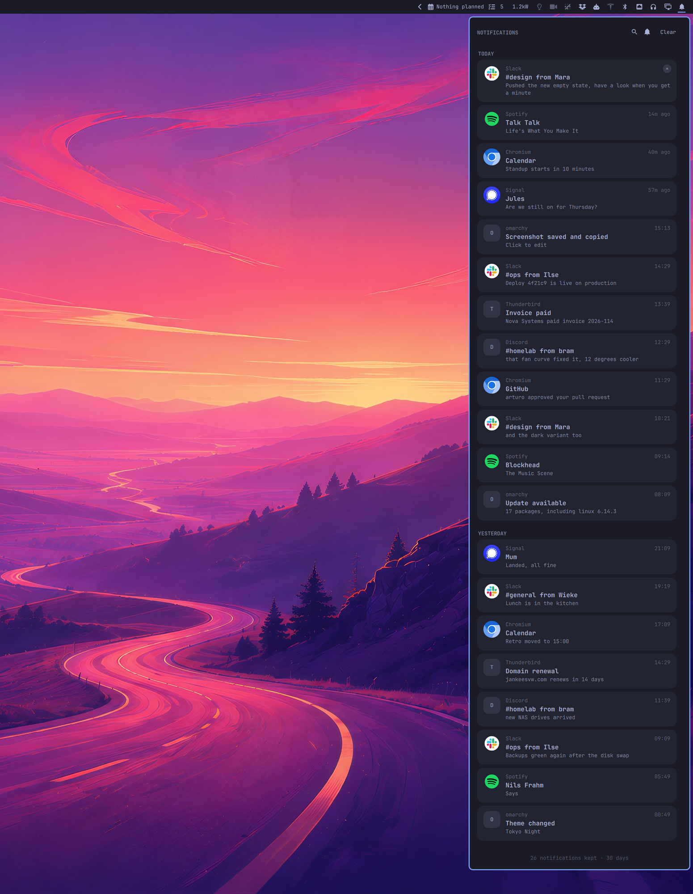

# Notification Center

An [Omarchy](https://omarchy.org) bar widget that keeps the notifications you
were sent. A bell on the right of the bar, a dot on it when something has come
in, and a panel of everything you were told, still there tomorrow.

Omarchy shows a notification once. This answers the question that comes ten
minutes later, in the middle of something else: *what did that say?*



## Install

```bash
omarchy plugin add https://github.com/jankeesvw/omarchy-notification-center.git --enable
```

Needs `jq` and `inotifywait`, both of which Omarchy already has. Leave the bell
at the far right of the bar: the panel is pinned to the right edge of the
screen, so a bell in the middle is a bell whose panel opens somewhere else.

## What it does

Omarchy's notification service already writes every notification to disk, and
then keeps only the last ten. This copies each one out of there as it lands,
icon and all, and keeps it for 30 days.

- One card per notification, newest first, under the day it arrived on.
- **A picture** when there was one. Cameras and screenshot tools hand their
  file to the notification's action rather than setting an image on it, so the
  path is read out of there and a scaled copy is kept.
- **Clicking a card** runs `omarchy-tasks open <note>` when that is what the
  toast carried (task done / smoke-check), which is the same argv as clicking
  the live notification. Otherwise it opens the picture, or focuses the app
  that sent it. Other stored commands are still discarded; only an absolute
  path to an image is kept besides that allowlisted argv.
- **The × on a card**, or a right-click, removes one. **Clear** draws a line
  under everything you have seen: the panel empties, and what was in it ages
  out through the ordinary retention limits instead of being deleted on the
  spot. Nothing is destroyed by a click, so nothing has to be confirmed.
- **The bell in the header** is Do Not Disturb, the same switch as the bar's.
  Right-clicking the bell in the bar does it without opening anything.
- **The magnifier**, or `/`, searches everything kept. Escape leaves the
  search, Escape again closes the panel.
- **No grouping**, on purpose. Ten identical messages are ten cards, not one card with a ×10 on it. A stack hides when each one arrived, and the newest one on top hides whether an older one was urgent. If an app sends the same thing ten times, that is worth seeing as it is.

## Settings

| Setting | Default | |
| --- | --- | --- |
| Mark what you have not read | Dot | `Dot`, `Highlight`, `Count` or `None` on the bell. `Highlight` colours the bell itself instead of adding anything to it. |
| Keep notifications for | 30 days | Older than this is deleted, icon and all. |
| Keep at most | 1000 | A ceiling regardless of age. |
| Clicking a notification | Auto | Runs `omarchy-tasks open` when the toast carried that argv (same as clicking the live notification). Otherwise opens the picture, or focuses the app. Other commands are not kept. |
| Show the message text | on | Off leaves the sender and subject only. |
| Show pictures | on | Off stops keeping copies as well. |
| Panel width | 420 | In the shell's spacing units. |
| List height | 0 | 0 runs the list to the bottom of the screen. |

## Where things are kept

`~/.local/state/omarchy-notification-center/`, one line of JSON per
notification plus a copy of every icon and picture. The directory is `0700`
and the archive `0600`, and only files that are actually images are copied
into it.

Worth knowing for one reason: **that is every notification you have been sent**,
chat messages and two-factor codes included. It never leaves the machine, but
it is not something to sync or back up carelessly. `Keep notifications for` is
the setting that limits the damage, and one day is a perfectly reasonable
answer to it.

Removing the plugin leaves the archive alone, on purpose:

```bash
omarchy plugin remove jankeesvw.notification-center
rm -rf ~/.local/state/omarchy-notification-center
```

## The command line

`bin/notification-center` is the storage side, and how you search further back
than the panel loads:

```
list [LIMIT]       the archive as JSON, newest first
remove KEY         drop one, or clear for all of them
seed [N]           fill it with test traffic
backfill           give older entries the picture their action points at
```

`watch`, `sync`, `seen`, `unread` and `prune` are in there too; everything
prints JSON.

```bash
# everything Slack sent you last week, as text
notification-center list 2000 | jq -r '.[] | select(.app == "Slack") | "\(.summary): \(.body)"'
```

The panel opens over IPC, which is how you bind it to a key:

```bash
omarchy-shell jankeesvw.notification-center toggle
```

## Licence

MIT.
